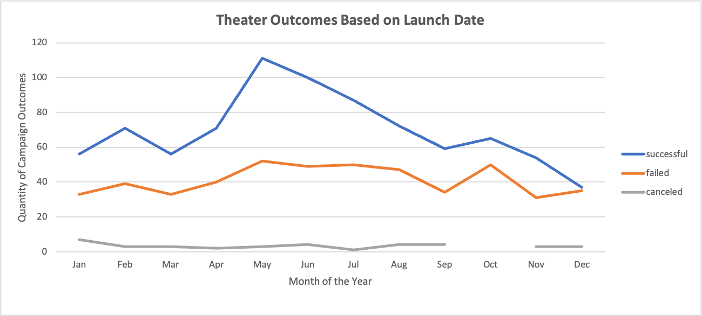

# **Kickstarting with _Excel_**

## Overview of Project
 The Vanderbilt University Data Analytics Bootcamp is a streamline of coursework that exposes students to a broad set of technical applications and data management concepts, strengthening their problem solving skills in data-driven contexts. Module 1 of the program focuses on Microsoft Excel, the use of statistical measures of spread, pivot tables, formulas, conditional formatting, and data visualization with charts, culminating with an analysis of a case study, detailed herein.  

### Purpose
Artistic productions face the challenge of budgets and time constraints, moderating the frequency of campaign success (i.e. productions that make it to audiences, consumers, etc.) and increasing the likelihood of failure or cancellation.  This analysis, performed on behalf of our client, Louise, sets out to unearth patterns explaining campaign success and failure, with an emphasis on theater productions (more specifically, plays), assessing what corrective or explanatory feedback can be provided to Louise. Only $2,485 of the goal of $2,885 were met for the fundraiser for her play, **_Fever_**, in the given four week timeframe, leading to campaign failure. 
## Analysis and Challenges

The dataset, held in a Microsoft Excel Workbook, detailed 4,114 campaigns taking place from 2009 to 2017 and recorded the following data for each:
 

[Resources/DataTypes.png](DataTypes)

The mix of categorical and numerical data yields the opportunity to correlate campaign outcomes (success, failure, or cancellation) with both fundamental aspects of fundraising structure  (fundraising goal in dollars, total amount pledged, campaign start and end date, etc.) and more tangential characteristics (location of project by country, number of campaign contributors, average donation per contributor).  Comparisons across project type (theater, film/video, photography) and subtype (plays, musical, drama, documentary, television) lay the groundwork for inter-industry and intra-industry comparison of campaign fundraising patterns across varying timeframes.  

The course framework advises pinpointing the analysis in ways that will help Louise most directly, as well as emphasizing the role **campaign launch date** had in campaign outcomes  as well as the role of **campaign funding goals**.

### Analysis of Outcomes Based on Launch Date

The pivot table below counts total number of theater campaign outcomes with campaign start dates of a particular month across the years in the study, helping highlight months with the greatest number of successful campaigns. The totals are summarized the line graph shown.

Dividing the quantity of successful campaigns beginning in any given month by total number of outcomes (_Grand Total_, within the below pivot table) for campaigns beginning in that month yield a ratio relevant to analysis. It is then converted to a percentage - the percentage of campaigns beginning in that month that are successful.  

[Resources/PivotTable_TOBLD.png](Link)

[Resources/Resources/Theater_Outcomes_vs_Launch.png](Link)

The pivot table was also used to count campaign outcomes across all month and year combinations within the datset, allowing us to compare theater KickStarter success during the time frame of Louise's campaign with that of other time periods.  

[Resources/PIVOT_TOBLD_Y.png](Link)

The count of successes are then divided by the count of outcomes for any given month, and given a percentage (ie., frequency of success for theaters campaigns given year/month of campign start date). A two sample t-test is performed to determine if the mean percentage of successful campaigns for theater projects beginning in summer months (June, July, August) is greater than the mean rate of success for theater campaigns that begin in fall, winter, or spring.  An F test confirms that the two sample distributions are equal in variance, suggesting that a two sample t-Test Assuming Equal Variances is appropropriate (F<F Critical One Tail).  

[Resources/Resources/RateSuccess_Month_Year.png](LINK)

[Resources/Resources/Resources/F_TTests.png](LINK)

### Analysis of Outcomes Based on Goals
Play KickStarter outcomes (success, failure, cancellation) are counted and filtered so that only play KickStarters are included (play being a _Subcategory_ of the theater _Category_, so measurements are not generalizeable to the sample included in the previous section, which included all _theater_ KickStarters), and these totals are sorted based on fundraising goals. Play KickStarter campaign outcomes as a function of campaign goals are summarized in a linechart to highlight possible trends of correlation.  Fundraising goals are grouped into ranges to identify optimal fundraising goal strategies for play KickStarters.     

### Challenges and Difficulties Encountered

Fundaising goals, measured in dollars, is a quantitative, numerical, and continuous measurement.  Meaningful trends in campaign outcomes could not manifest when any single  campaignn fundraising goal is correlated with success, cancellation, or failure.  If that were attempted, there would be few trends to illustrate as few campaign goals are repeated in exactitude across multiple KickStarters in the dataset.

The continuous data needs grouping to be utilized.  Excel's conditional functions (e.g. , COUNTIF, COUNTIFS, AVERAGEIF, AVERAGEIFS) enable users to group continuous data into larger, discrete groups, or categories that enable high-level analysis, and were employed in the analysis of play outcomes based on goals.

## Results

- **What are conclusions you can draw about the Outcomes based on Launch Date?**

A mean of 70 successful theater KickStarter campaigns began in any given month.  The number of successes tended to peak in May (111), June (100) and July (87), with 67%, 65%, and 63% of all theater campaigns started in those months suceeding, respectively.   Likewise, May (33%), June (35%), and July (37%) were the least likely to yield either cancellation or failure by percentage.  With the p-value <0.05 (0.0495), t-test results suggest that theater campaigns begun in the summer are more likely to succeed (higher mean success rate) than those that are started in the fall, winter, or spring. That would imply that Louise's campaign, which began in June of 2016, was well-timed.

However, this trend of success for theater campaigns beginning in the summer months was not as pronounced in 2016. The year of **_Fever's_** campaign, 2016, KickStarter campaigns were most likely to succeed in July (83%), April (76%), and August (71%), not June. Campaigns that began in June of 2016 were the third least likely to succeed of any month that year, with at only a 51% success rate, well below the mean of 64% for all months and preceded only by September (50%) and December (41%).  Moreover, June 2016 had the lowest success rate of any summer month (June, July, or August) in the data set for theater campaigns from 2019 - 2017. 

An analysis of any market factors occuring in June 2016 that would explain the lower-than-typical success rate might be of use, in addition to an investigation into what  factors within Louise's control contributed to **_Fever's_** failure to launch.  If part of her campaign strategy was to reap the benefits of a more forgiving summertime campaign environment, she would have been very unlucky, as she was saddled with campaigning in the least forgiving month of any summer from 2010 to 2017.

- **What can you conclude about the Outcomes based on Goals?**

Play campaigns with fundraising goals of less than $1000 tended to succeed more than campaigns with higher fundraising goals, with a success rate of 76%.  Louise's campaign raised $2,485, indicating that her budget and capacity to fundraise mimicked that of the plays in the goal range with the second greatest frequency of success (73% success rate, range $1000 - $4,999).  With these indications that her capacity to raise funds was sufficient for her industry, it may be better to review other measurements for explanations for her campaign's failure, such as the number of donations, or average given per donor, which is explored in more detail below.

- **What are some limitations of this dataset?**

Only 82 play KickStarters had campaign goals of at least $15,000, versus 961 total projects with goals of less than $15,000.  More data would be helpful to shed light on the success rate of campaigns with fundraising goals in the higher range.  While it might be possible to assess differences in means (ie, t-tests) between groups with lower or higher fundraising goals, the amount of data would be insufficient for such testing at the Category or Subcategory level. In addition, only 26 records of theater outcomes from 2010 - 2013 are included in the data, limiting the ability to use the data in a longitudinal scope to analyze KickStarter market trends over longer stretches of time (e.g., 5-yr, decades).

- **What are some other possible tables and/or graphs that we could create?**

Another explanation for **_Fever's_** failure is Louise's donation strategy.  Succesful play campaigns had a mean fundraising goal of $5,049, greater than her campaign's goal of $2,885. Successful campaigns made more money than Louise, but did so by accruing a higher volume of donors making contributions in smaller amounts.  **_Fever's_** 10 contributors donated an average of $249, while successful play fundraisers in a similar goal range ($4,999 or less) had a mean of 41 donors contributing $68 dollars per campaign.  

This implicates Louise's campaign marketing strategy, as a successful campaign with **_Fever's_** average donation would be an outlier ($249 is greater than 1.5*IQR+Upper Quartile) within the set of mean donation amounts for successful play campaigns.  A dataset confirming how directors of successful play KickStarter campaigns sought donations (in-person, phone, email, text, etc.), the amount sought from potentional donors (suggestion donation amount), and variation in outcomes amongst the marketing strategies employed, in addition to knowledge of Louise's promotional strategy for comparison could lay the foundation for further insights.

