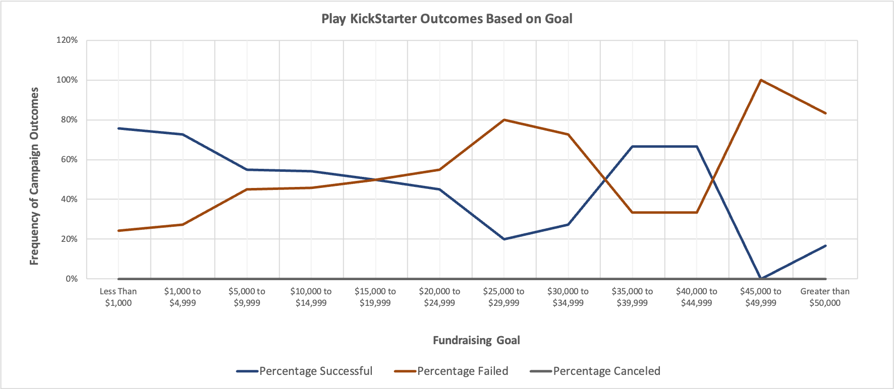

# **Kickstarting with _Excel_**

## Overview of Project
 The Vanderbilt University Data Analytics Bootcamp is a streamlined coursework pipeline that exposes students to a broad set of technical applications and data management concepts, strengthening their problem solving skills in data-driven contexts. Module 1 of the program focuses on Microsoft Excel, the use of statistical measures of spread, pivot tables, formulas, conditional formatting, and data visualization with charts, culminating with the case study detailed herein.  

### Purpose
Artistic productions face the challenge of budgets and time constraints, moderating the frequency of campaign success (i.e. productions that make it to audiences) and increasing the likelihood of failure or cancellation.  This analysis, performed on behalf of our client, Louise, sets out to unearth patterns explaining campaign success and failure, with an emphasis on theatre productions (more specifically, plays), assessing what corrective feedback can be provided. Only $2,485 of the goal of $2,885 were met for the fundraiser for her play, **_Fever_**, in the given four week timeframe, leading to campaign failure. 
## Analysis and Challenges

The dataset, held in a Microsoft Excel Workbook, detailed 4,114 campaigns taking place from 2009 to 2017 and recorded the following data for each of the campaigns:
 

The mix of categorical and numerical data yields the opportunity to correlate campaign outcomes with both fundamental aspects of fundraising structure  (goal funds raised, total amount pledged, start date, end date ) and more tangential factors (location of project by country, number of campaign contributors).  Comparisons across project type (theatre, film/video, photography) and subtype (plays, musical, drama, documentary, television) lay the groundwork for inter-industry, intra-industry, inter-country, and intra-country comparison of campaign fundraising patterns.  For the purpose of helping Louise, unearthing

### Analysis of Outcomes Based on Launch Date

### Analysis of Outcomes Based on Goals

### Challenges and Difficulties Encountered

## Results

- What are two conclusions you can draw about the Outcomes based on Launch Date?

- What can you conclude about the Outcomes based on Goals?

- What are some limitations of this dataset?

- What are some other possible tables and/or graphs that we could create?
